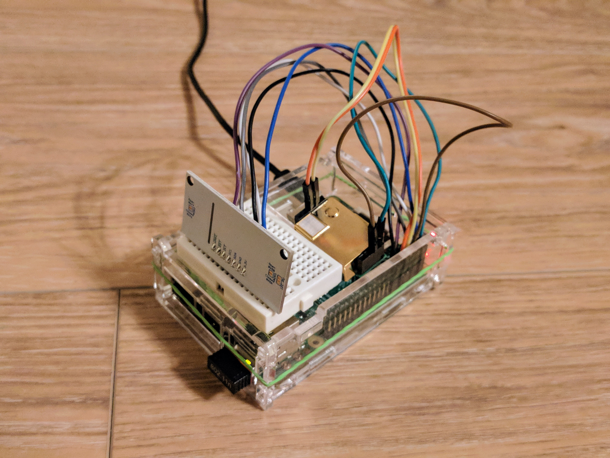
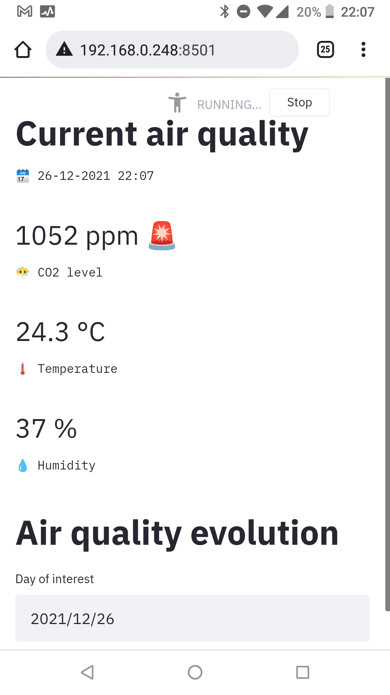
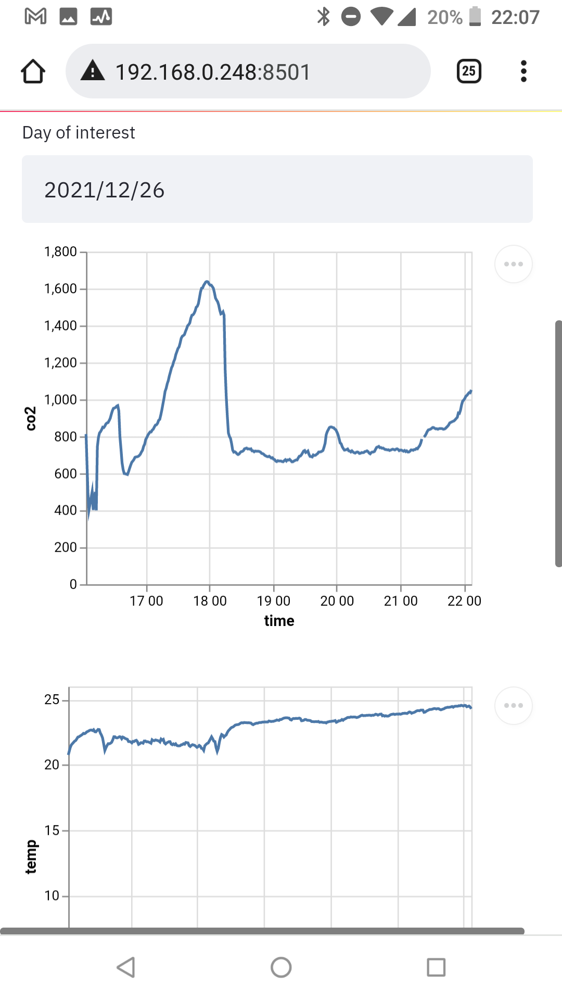
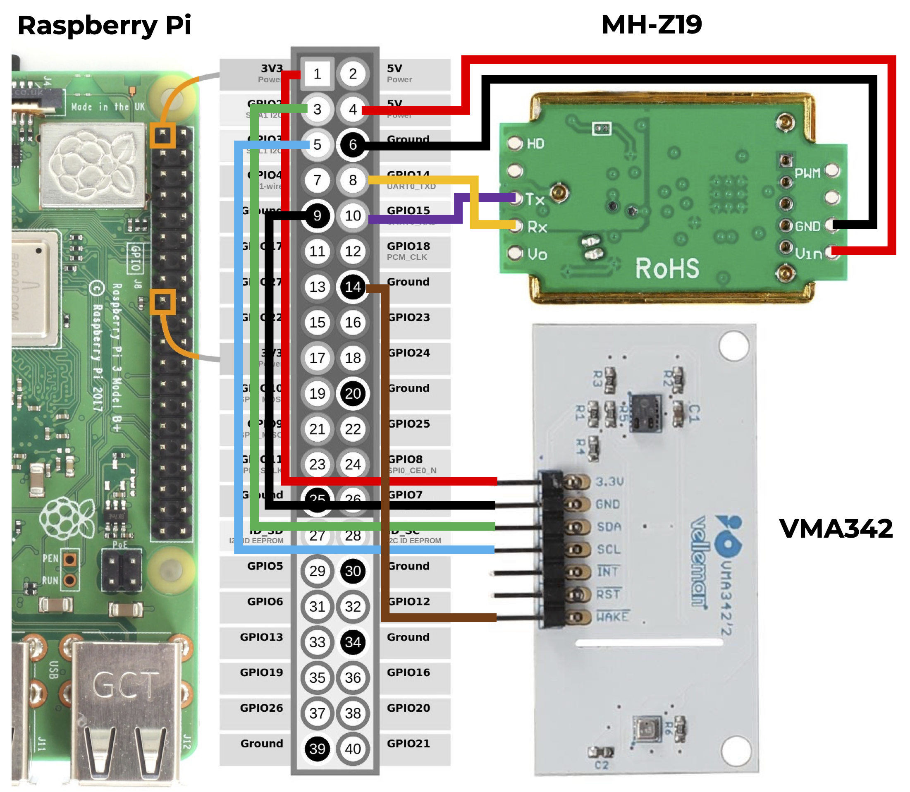

# Air quality monitoring with Raspberry Pi

In this project, we'll monitor several parameters of indoor air quality with a Raspberry Pi and the following sensors:
- MH-Z19 -> **CO2**
- VMA342, consisting of:
    - BME280 -> **temperature** + **humidity** + **air pressure**
    - CCS811 -> volatile organic compounds (**TVOC**) [Work in progress]


<br/>
A Streamlit dashboard will allow you to monitor the current air quality as well as the evolution over time:
<table>
    <tr>
        <td></td>
        <td></td>
    </tr>
</table>

## Requirements
- Raspberry Pi<sup>*</sup>, including:
    - MicroSD card
    - Micro USB power cable and adapter
    - Protective case
    - WiFi dongle (for RPi's older than model 3)
- [VMA342 sensor](https://www.velleman.eu/products/view?id=450324)
- [MH-Z19 sensor](https://www.hobbyelectronica.nl/product/mh-z19b-co2-sensor/)<sup>**</sup>
- Small breadboard
- Jumper cables (male-female)
- Ethernet cable for the initial setup

<sup>*</sup>I used a Raspberry Pi model 2B for this project. Other models likely work as well, but weren't tested.

<sup>**</sup>The MH-Z19 sensor comes in [multiple versions](https://emariete.com/en/sensor-co2-mh-z19b/). I used the MH-Z19B. The [mh-z19 python library](https://pypi.org/project/mh-z19/) seems to support at least the MH-Z19 and MH-Z19B. If your sensor doesn't come with output pins (like mine), you'll have to solder some stacking headers yourself.

## General Raspberry Pi setup

### Install OS and activate SSH
1. Install [Raspberry Pi Imager](https://www.raspberrypi.com/software/).
2. Insert micro SD card and install the Raspberry Pi OS using Raspberry Pi Imager.
3. Add “SSH” File to the SD Card Root (`touch /Volumes/boot/ssh`).
4. Insert the SD card, connect your computer and Pi with an ethernet cable and boot the Pi by plugging in the power cord.
5. Connect with the Pi via SSH: `ssh pi@raspberrypi.local`, default password = `raspberry`.

### Connect the RPi to WiFi

The following steps will allow you to SSH into your Raspberry Pi over Wifi instead of over ethernet.

1. On the Pi, edit the `wpa_supplicant.conf` file by adding your Wifi networks ssid and password as shown below:

`sudo nano /etc/wpa_supplicant/wpa_supplicant.conf`

Add the following content:

```
ctrl_interface=DIR=/var/run/wpa_supplicant GROUP=netdev
update_config=1
country=be                                           

network={
    ssid="my-ssid"
    psk="my-password"
}
```

2. `sudo reboot`
3. Check the WiFi connection: `ifconfig wlan0` An IP address should be visible if the connection was successful.


## Wiring the hardware

Connect the Raspberry Pi and MH-Z19 as follows:
<table>
    <tr>
        <th>RPi</th>
        <th>MH-Z19</th>
    </tr>
    <tr>
        <td>5V</td>
        <td>Vin</td>
    </tr>
    <tr>
        <td>GND</td>
        <td>GND</td>
    </tr>
    <tr>
        <td>TXD</td>
        <td>Rx</td>
    </tr>
    <tr>
        <td>RXD</td>
        <td>Tx</td>
    </tr>
</table>

Note how the TXD and RXD are cross connected between the RPi and MH-Z19.

Connect the Raspberry Pi and VMA342 as follows:
<table>
    <tr>
        <th>RPi</th>
        <th>VMA342</th>
    </tr>
    <tr>
        <td>3V3</td>
        <td>3.3V</td>
    </tr>
    <tr>
        <td>GND</td>
        <td>GND</td>
    </tr>
    <tr>
        <td>SDA</td>
        <td>SDA</td>
    </tr>
    <tr>
        <td>SCL</td>
        <td>SCL</td>
    </tr>
    <tr>
        <td>GND</td>
        <td>WAKE</td>
    </tr>
</table>



## Project specific setup
Install the packages below in order to interact with the sensors:

### MH-Z19 (CO2)

- Enable Serial via `sudo raspi-config` ([source](https://github.com/UedaTakeyuki/mh-z19/wiki/How-to-Enable-Serial-Port-hardware-on-the-Raspberry-Pi))

- Install the [mh-z19 package](https://pypi.org/project/mh-z19/) with `sudo pip install mh-z19`


### VMA342
#### General
- `pip install wheel` (not sure whether really required)
- Install RPi.GPIO with `export CFLAGS=-fcommon` and `pip3 install RPi.GPIO` ([source](https://raspberrypi.stackexchange.com/questions/119632/ubuntu-20-10-and-gpio))
- Enable I2C via `sudo raspi-config` ([source](https://raspberrypi.stackexchange.com/questions/66145/raspberry-pi-3-not-detecting-i2c-device))
- Optionally adding the I2C module to the kernel: `sudo nano /etc/modules` and add `i2c-dev` to the end of the file.
- Reduce the baudrate in order to make the sensor compatible with Raspberry Pi: `sudo nano /boot/config.txt and add dtparam=i2c_arm_baudrate=10000 (source)`

Tip: `i2cdetect -y 1` shows the current I2C connections.

#### BME280 (temperature + humidity + air pressure)

- `sudo pip install RPi.bme280`

Example to try out the CCS811 library:
```python
import smbus2
import bme280

port = 1
address = 0x77
bus = smbus2.SMBus(port)

calibration_params = bme280.load_calibration_params(bus, address)

# the sample method will take a single reading and return a
# compensated_reading object
data = bme280.sample(bus, address, calibration_params)

# the compensated_reading class has the following attributes
print(data.id)
print(data.timestamp)
print(data.temperature)
print(data.pressure)
print(data.humidity)

# there is a handy string representation too
print(data)
```

#### CCS811 (TVOC + eCO2)
*⚠️ STILL WIP. A BUG OCCURS WHEN READING OUT THE TVOC (and eCO2) VALUES*

[datasheet](https://cdn.sparkfun.com/assets/learn_tutorials/1/4/3/CCS811_Datasheet-DS000459.pdf)

- `pip3 install adafruit-circuitpython-ccs811`

Example to try out the [CCS811 library](https://pypi.org/project/adafruit-circuitpython-ccs811/):
```python
import board
import adafruit_ccs811

i2c = board.I2C()  # uses board.SCL and board.SDA
ccs811 = adafruit_ccs811.CCS811(i2c, 0x5b)

# Wait for the sensor to be ready
while not ccs811.data_ready:
    pass

while True:
    print("CO2: {} PPM, TVOC: {} PPB".format(ccs811.eco2, ccs811.tvoc))
    time.sleep(0.5)
```
Note that `0x5b` is the I2C address of the CCS811 on the VMA342 board ([default is `0x5a`](https://github.com/adafruit/Adafruit_CircuitPython_CCS811/blob/main/adafruit_ccs811.py)).

### Streamlit
- `pip install streamlit=0.62.0` ([Installing Streamlit>0.62 on Raspberry Pi isn't straightforward because of dependency on PyArrow](https://discuss.streamlit.io/t/raspberry-pi-streamlit/2900/6))
- `pip install numpy==1.20`
- `sudo apt-get install libatlas-base-dev`
- `export PATH="$HOME/.local/bin:$PATH"` ([source](https://discuss.streamlit.io/t/command-not-found/741/7))

### Automatically run the scripts on startup
- `chmod 664 ~/Documents/airmon/monitor.py`
-  Run `crontab -e` and append the following command to the bottom of the file:
```
@reboot (/bin/sleep 30; sudo python3 /home/pi/Documents/rpi-airquality/src/monitor.py > /home/pi/cronjoblog-monitor 2>&1)
@reboot (/bin/sleep 30; export PATH=$PATH:/home/pi/.local/bin; streamlit run /home/pi/Documents/rpi-airquality/src/dashboard.py > /home/pi/cronjoblog-dashboard 2>&1)
*/5 * * * * /bin/ping -c 2 www.google.com > /home/pi/cronjoblog-ping.txt 2>&1
```
This will start the monitoring script and Streamlit dashboard on startup. Logs will be printed to the specified files in the `/home/pi/` folder.
The third command will ping every five minutes in order to prevent the Raspberry Pi from losing internet connection ((source)[https://forums.raspberrypi.com/viewtopic.php?t=274966]).

Note that in order to streamlit to work from the cron job, the second statement adds the streamlit path to `$PATH`. This streamlit path can be found by running `which streamlit`. Which returns something like `/home/pi/.local/bin/streamlit`. Addapt the above line accordingly. The reason is that in cron, PATH is restricted to `/bin:/usr/bin` ([source](https://serverfault.com/questions/449651/why-is-my-crontab-not-working-and-how-can-i-troubleshoot-it)).

Extra: to make sure that the cron jobs have run, you can use the following command: `grep CRON /var/log/syslog`

### Turn of the LED's of the Raspberry Pi (optional)
**Raspberry Pi 3**
- Run `crontab -e` and append the following command to the bottom of the file ([source](https://forums.raspberrypi.com/viewtopic.php?t=149126#p1306079)):
```
@reboot (/bin/sleep 30; sudo sh -c 'echo 0 > /sys/class/leds/led0/brightness')
@reboot (/bin/sleep 30; sudo sh -c 'echo 0 > /sys/class/leds/led1/brightness')
```

**Raspberry Pi 4**
- `sudo nano /boot/config.txt`
- Add the following lines below the `[Pi4]` settings ([source](https://forums.raspberrypi.com/viewtopic.php?t=252049)):
```
# Disable the PWR LED
dtparam=pwr_led_trigger=none
dtparam=pwr_led_activelow=off
# Disable the Activity LED
dtparam=act_led_trigger=none
dtparam=act_led_activelow=off
# Disable ethernet port LEDs
dtparam=eth_led0=4
dtparam=eth_led1=4
```
- The lights will turn off once the Raspberry Pi has been restarted.

## View dashboard
The Streamlit dashboard can be viewed from any device connected to the local network at the following address: [http://raspberrypi.local:8501/](http://raspberrypi.local:8501/)